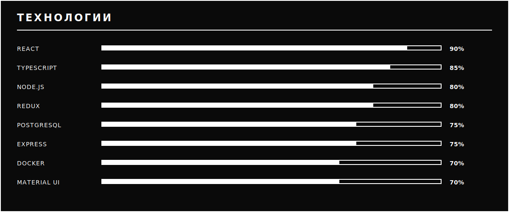

<table width="100%" bgcolor="#0a0a0a">
<tr>
<td>

  

 

<table align="center" bgcolor="#0a0a0a">
<tr>
  <td width="50%" align="center" bgcolor="#0a0a0a">
    
  </td>
  <td width="50%" align="center" bgcolor="#0a0a0a">
    
  </td>
</tr>
<tr>
  <td width="50%" align="center" bgcolor="#0a0a0a">
    
  </td>
  <td width="50%" align="center" bgcolor="#0a0a0a">
    
  </td>
</tr>
</table>

  

  

  

<table align="center" bgcolor="#0a0a0a">
<tr>
  <td align="center" bgcolor="#0a0a0a">
    
  </td>
  <td align="center" bgcolor="#0a0a0a">
    
  </td>
</tr>
<tr>
  <td align="center" bgcolor="#0a0a0a">
    
  </td>
  <td align="center" bgcolor="#0a0a0a">
    
  </td>
</tr>
</table>

  

  <strong>━━━━━━━━━━━━━━━━━━━━━━━━━━━━━━━━━━━━━━━━━━━━━━━━━━━━━━━━━━━━━━━━━━━━━━━━━━━━━━</strong>

  
  <strong>&nbsp;&nbsp;|&nbsp;&nbsp;</strong>
  

   
  <strong>SCHOOL 21 • МТУСИ • GEEKBRAINS</strong>

 

</td>
</tr>
</table>
