  

 

## 💻 Технологический стек

<table align="center">
<tr>
  <td align="center" width="33%">
    <h3>Frontend</h3>
     
    
     
    
     
    
     
    
  </td>

  <td align="center" width="33%">
    <h3>Backend</h3>
     
    
     
    
     
    
     
    
  </td>

  <td align="center" width="33%">
    <h3>DevOps</h3>
     
    
     
    
     
    
     
    
  </td>
</tr>
</table>

 

## 🚀 Избранные проекты

<table align="center">
<tr>
  <td width="50%" valign="top">
    <h3><a href="https://github.com/noshackleshot/FrontendProjects">Frontend Projects</a></h3>
    
Коллекция современных веб-приложений на React с TypeScript

    
<code>React</code> <code>TypeScript</code> <code>Redux</code>

  </td>

  <td width="50%" valign="top">
    <h3><a href="https://github.com/noshackleshot/containerds">ContainerDS</a></h3>
    
Собственная библиотека контейнеров и структур данных на C

    
<code>C</code> <code>Data Structures</code> <code>Algorithms</code>

  </td>
</tr>

<tr>
  <td width="50%" valign="top">
    <h3><a href="https://github.com/noshackleshot/gOzon">gOzon</a></h3>
    
E-commerce платформа с микросервисной архитектурой

    
<code>Go</code> <code>Microservices</code> <code>PostgreSQL</code>

  </td>

  <td width="50%" valign="top">
    <h3><a href="https://github.com/noshackleshot/dezimal">Dezimal</a></h3>
    
Кастомный тип данных для работы с высокоточными числами

    
<code>C</code> <code>Algorithms</code> <code>Math</code>

  </td>
</tr>
</table>

 

## 📊 Статистика

  

 

## 📫 Контакты

  
  &nbsp;&nbsp;
  

 

---

  <strong>School 21 • МТУСИ • Geekbrains</strong>
    
  <em>Работаю в крупной российской компании</em>

